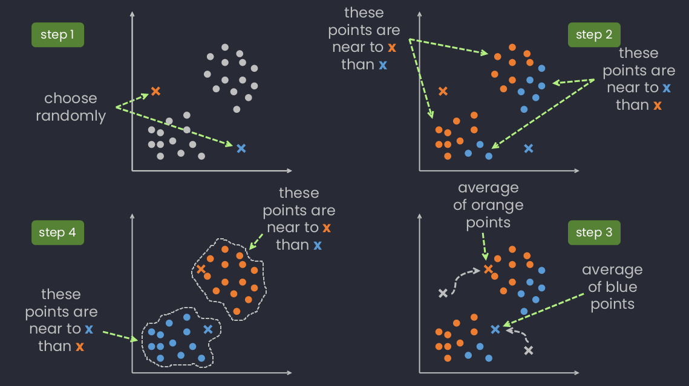
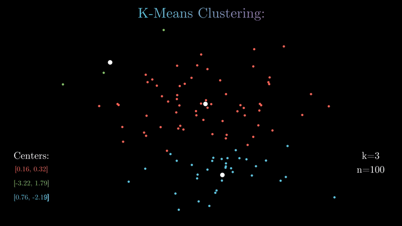

# Image Compressor

A pretty basic way to compress image consists in reducing the number of colors it contains.  
3 steps are needed to do so:  

1. read the image and extract the colors of each pixel,
2. cluster these colors, and replace each color of a given cluster by the mean color of this cluster,
3. index the means of the cluster, and create the compressed image.

## Description

```bash
USAGE: ./imageCompressor -n N -l L -f F

        N       number of colors in the final image
        L       convergence limit
        F       path to the file containing the colors of the pixels
```

## Quick-start

```bash
make
./imageCompressor -n 2 -l 0.8 -f input
```

## Algorithm

**K-means**




## Authors

[<br><sub>Coline Seguret</sub>](https://github.com/Cleopha) | [<br><sub>Benjamin Reigner</sub>](https://github.com/Breigner01) 
| :---: | :---: |