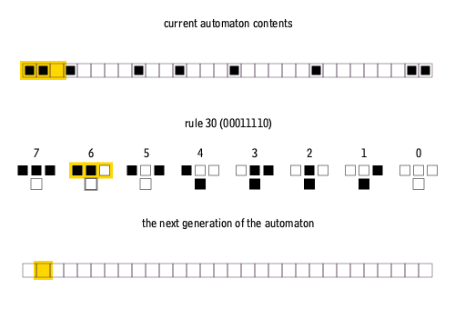

# Wolfram

The goal of this project is to implement Wolfram’s elementary cellular automaton in the terminal.  

## Description

```bash
USAGE:

        ./wolfram [Options]

Options:

        -h              display usage
        --help          display usage
        --rule          rule to generate [0:255] (Required)
        --start         first generation to display [<0] (Default: 0)
        --lines         number of lines to displau [<0] (Default: infinity)
        --window        number of cells by line [<0] (Default: 80)
        --move          translation to apply (Default: 0)
```

## Quick-start

```bash
make
./wolfram --rule 90 --lines 20 --start 100
```

## Algorithm

